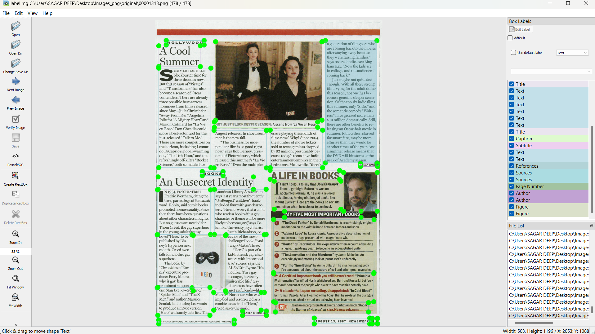
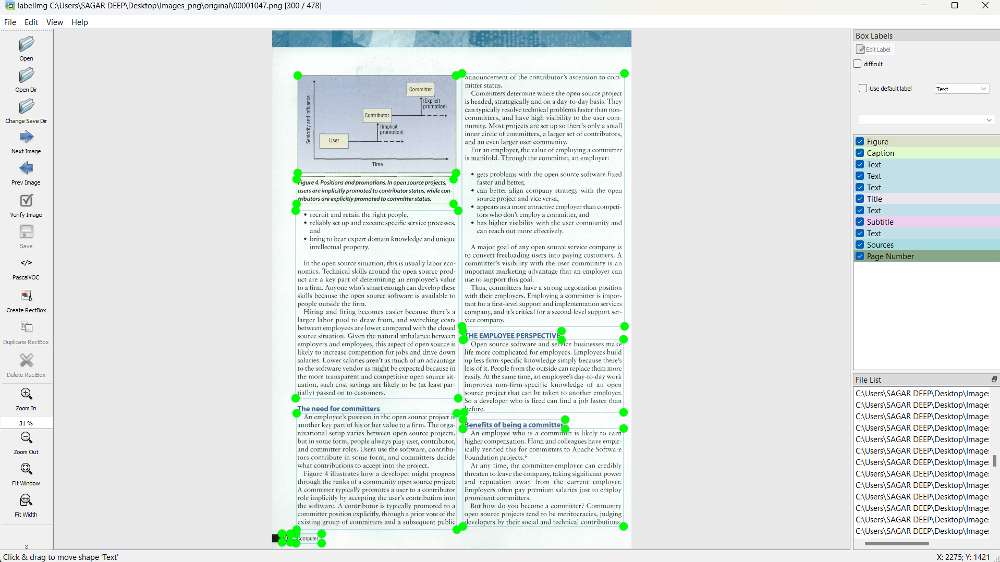
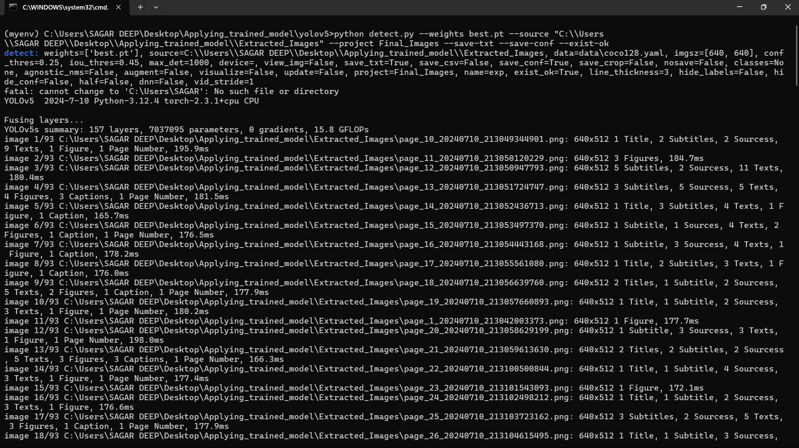
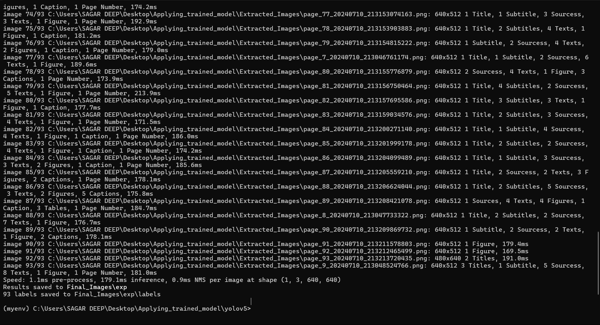
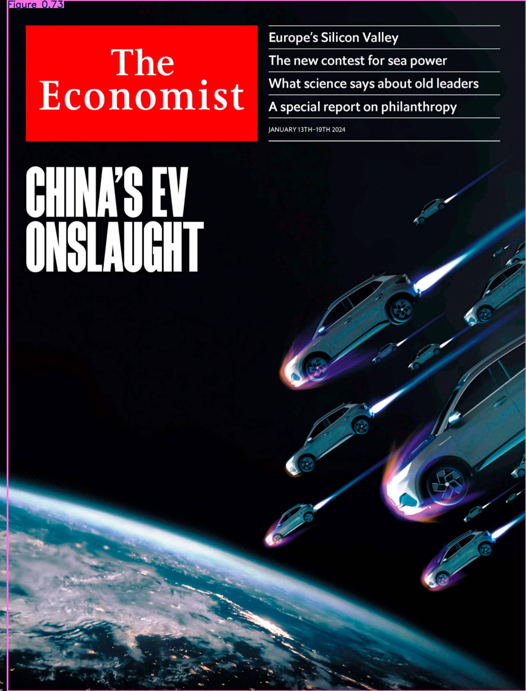
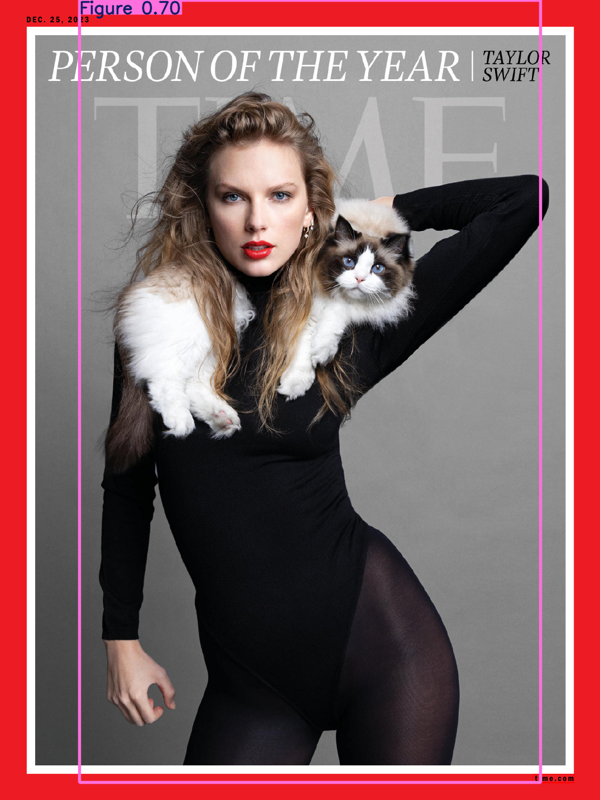
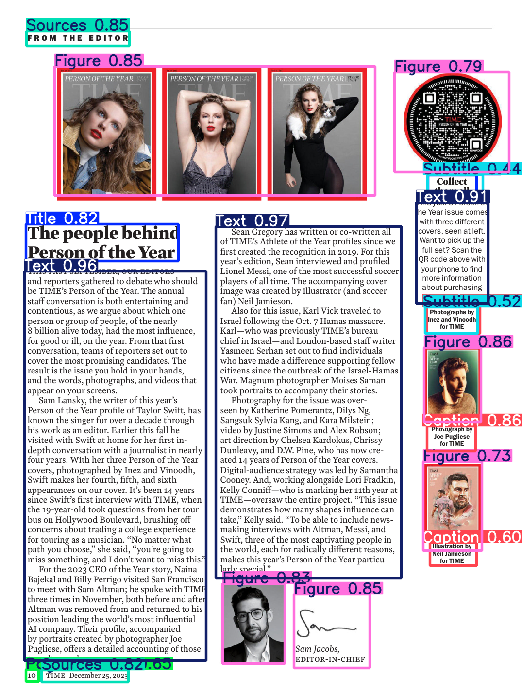
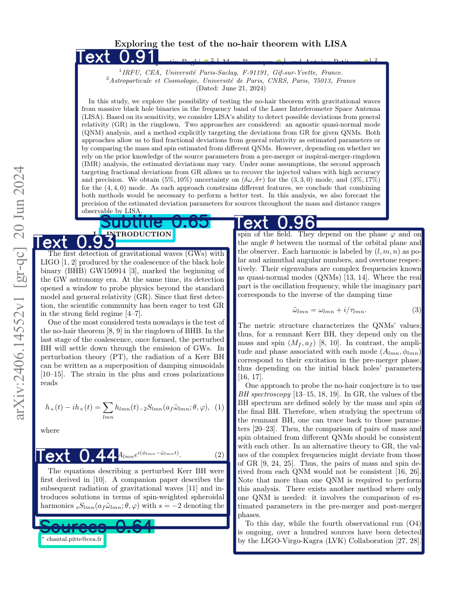
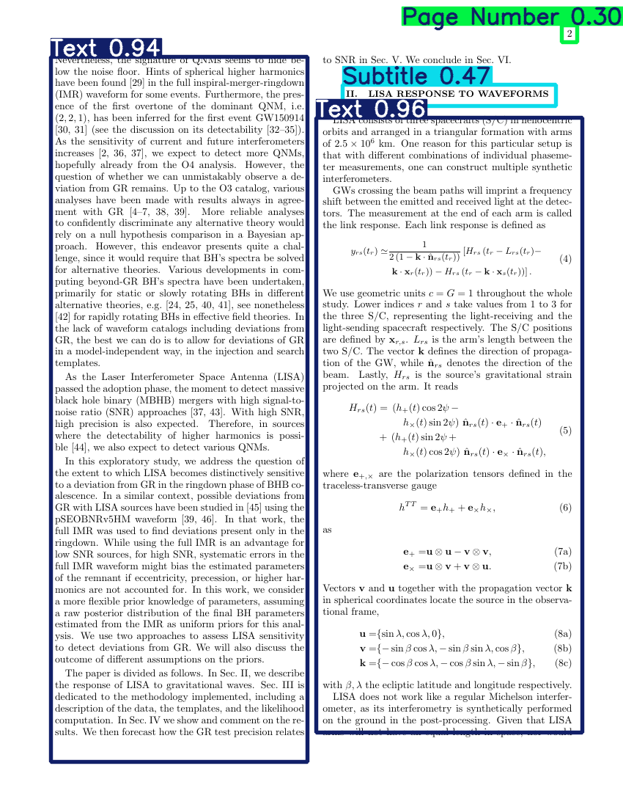

# Document Layout Analyser

## Results

Check it out on drive using the below link. 

https://drive.google.com/drive/folders/1ULrFcmYAd_qAE3VoaJvZ2hwcituJGxTq?usp=sharing

## Description

This tool extracts images from a PDF then annotates it using YOLOv5 model.

Finally the annotated images are converted into a single PDF.

## Illustration

https://github.com/SDpDas/YOLOv5-DocAnalyser/assets/104672899/09b33dc5-023d-43bc-80bd-2702b9ebb3e7

### Watch it here to get better view

https://www.youtube.com/watch?v=QszPk-E6d2c

## Overview

### Step 1. Annotate images using labelImg

   I had a huge dataset of images which had numerous magazines, research articles, papers into it.

   This had to be annotated manually using labelImg

   https://github.com/HumanSignal/labelImg

   Make sure you have class file with all object segments pre-planned before the task.

   I used here windows + anaconda setup 

   ```python
   conda install pyqt=5
   pyrcc5 -o libs/resources.py resources.qrc
   python labelImg.py
   pip install lxml
   python labelImg.py [IMAGE_PATH] [PRE-DEFINED CLASS FILE]
   ```
   
### Step 2. Convert XML to YOLO format
    
   Annotate the images using labelImg tool and autosave each image to make the process faster.
   Use CTRL + W to open rectbox, A to move back to last image, D to move to next image

   After it's complete, results will be in .XML (VOC format)

   We need to convert it into .YOLO format

   For YOLO files the text will appear as {class no., x-coordinate, y-coordinate, height, width}


### Step 3. Create dataset file
   
   Make a dataset file having train, val and test path, add no. of classes (nc) and class names.
   Save it as dataset.yaml and in the dataset. 
   Now we're ready to make the dataset to be used in training

   Here's my dataset - https://www.kaggle.com/code/sagardeepdas/yolov5-model1

### Step 4. Split dataset into training classes 

   Create a new folder with all original images (from 1), yolo_labels and xml_files (from 2).
   
   We need to split all the images and labels into three training classes -
   Train - 70 percent
   Validation - 20 percent
   Testing - 10 percent (Optional)

   Directory should exactly look like this

   -- Dataset folder
    -- images
     --train
      -- img1.png
      -- img2.png
      -- ....
     --val
      -- img1.png
      -- img2.png
      -- ....
     --test
      -- img1.png
      -- img2.png
      -- ....

    -- labels
     --train
      -- label1.txt
      -- label2.txt
      -- ....
     --val
      -- label1.txt
      -- label2.txt
      -- ....
     --test
      -- label1.txt
      -- label2.txt
      -- ....
     
    -- original image
    -- yolo_labels
    -- dataset.yaml
   

### Step 5. Train the Model

   Register, Upload this dataset and Make a new notebook
   
   Choose a powerful GPU like Tesla T4. Turn on the internet and download the dataset.
   Clone yolov5 repository, install dependencies and then start the training.

   ```python
   !python train.py --img 640 --batch 16 --epochs 100 --data dataset.yaml --cfg models/yolov5s.yaml --weights yolov5s.pt --name Test001
   ```

### 6. Test the model

   After its completed download detect.py and the weights best.pt

   Create a folder with pdf's you want to test the model on. Save detect.py and best.pt in it. 

   Clone yolov5 repo from github and make a code to convert the PDF to images.

   Start the training.

   ```python
   python detect.py --weights best.pt --source <image_folder_path> --project Final_Output --save-txt --save-conf --exist-ok
   ```

### 7. Convert annotated images to PDF

   Observe the results in Final_output folder. 
   To convert into PDF use pdf2img and define function that takes annotated images and returns pdf output. 
   Use timestamp to differentiate each pdf created.

## Screenshots:




### Training done by Kaggle ➔
https://imgur.com/a/QmJpNGh

### YOLOv5 Metrics and Data Analysis ➔
https://imgur.com/a/EcXaThW

### Batch Results ➔
https://imgur.com/a/QFzXbLY











# Created by Sagardeep Das
